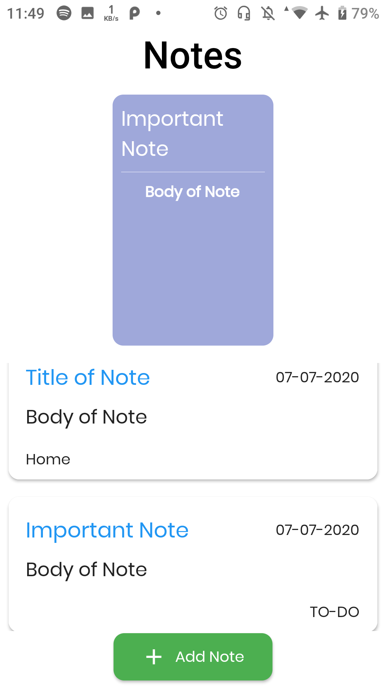
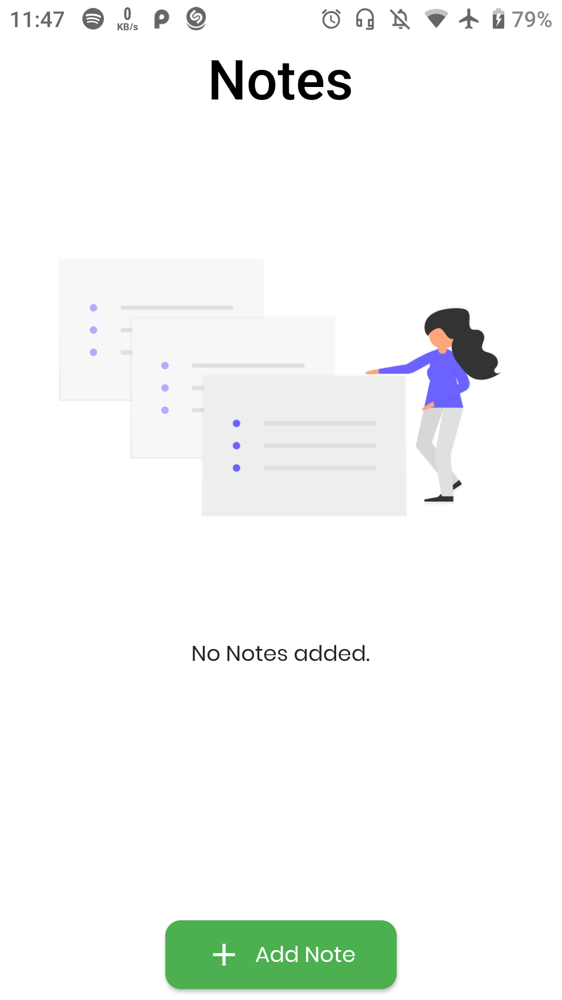
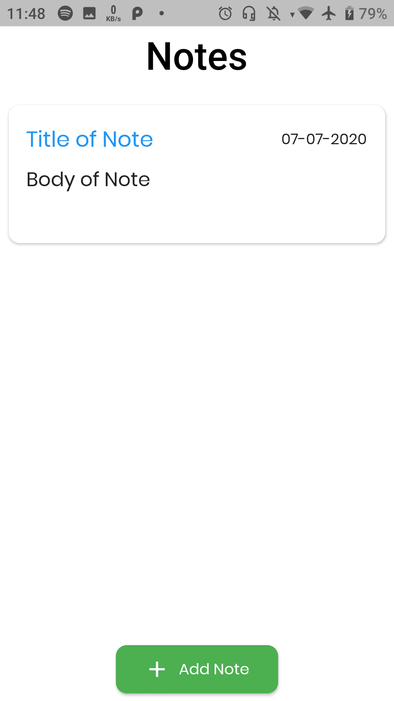
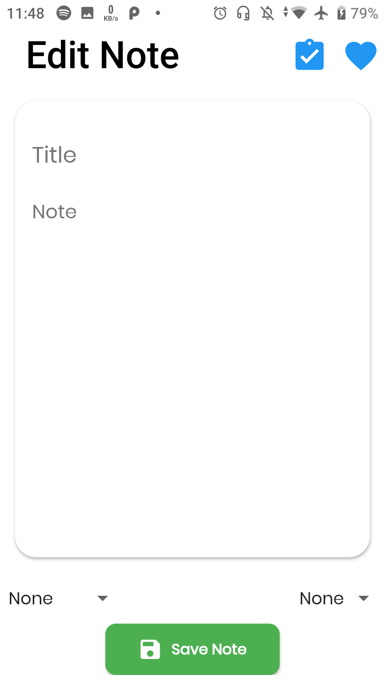

# Note Worthy

A minimal  Note taking Application built using Flutter and Moor Library.

Note Worthy is free and Open Source, Cross Platform Application developed using [Flutter](https://github.com/flutter/flutter).

## Download the App

## About
Stores notes on the device , categroies and priorities available. 

### The android app lets you:

- Store Notes.
- Categorize with priority

## Screenshots

### Home Screen

### Empty Notes

### Notes

### Edit Note

## Permissions

On Android versions prior to Android 6.0, MooovieX requires the following permissions:
- Storage Acces - Saving notes on the device .

## Contributing

Note Worthy  app is a free and open source project. Any contributions are welcome. Here are a few ways you can help:
 * [Report bugs and make suggestions.](https://github.com/adarshbalu/note_worthy/issues)
 

## Credits  

Thanks to  Freepik (http://www.freepik.com) for the app icon.

## License

This application is released under GNU GPLv3 (see [LICENSE](LICENSE)).
Some of the used libraries are released under different licenses.

